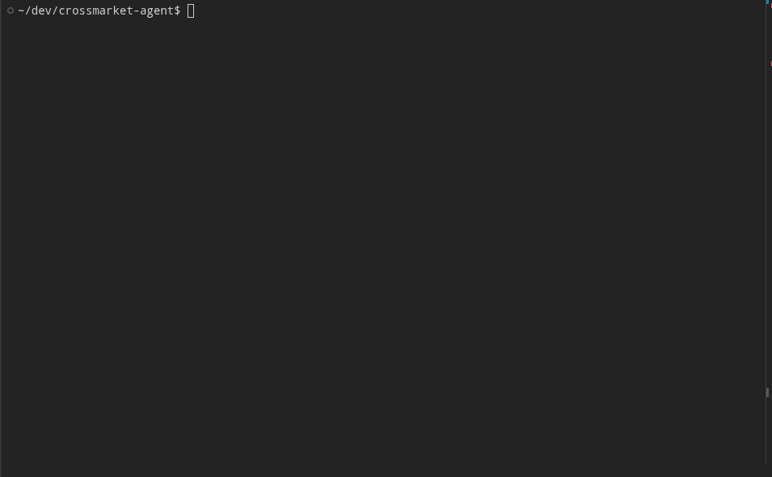
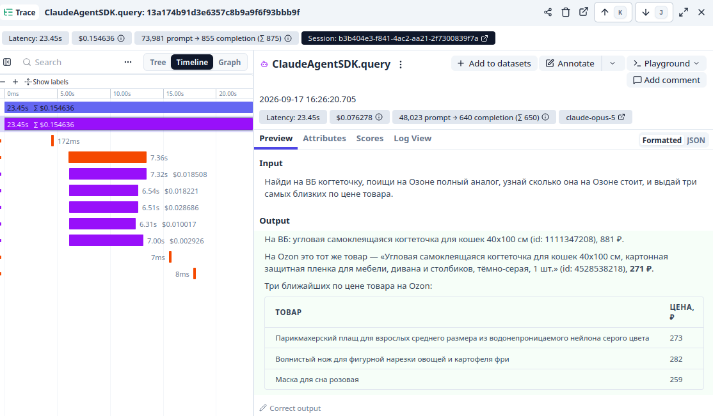
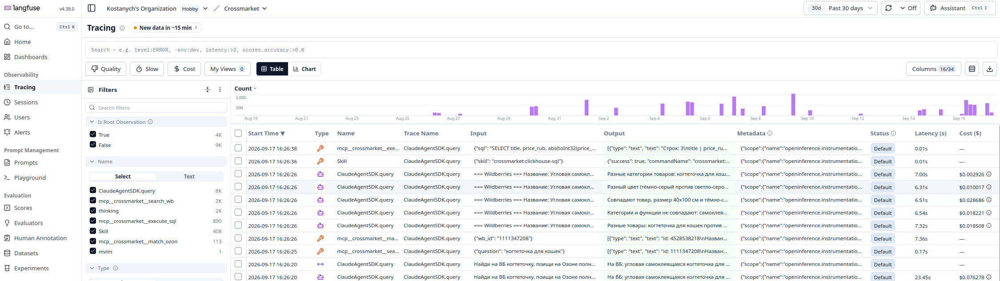
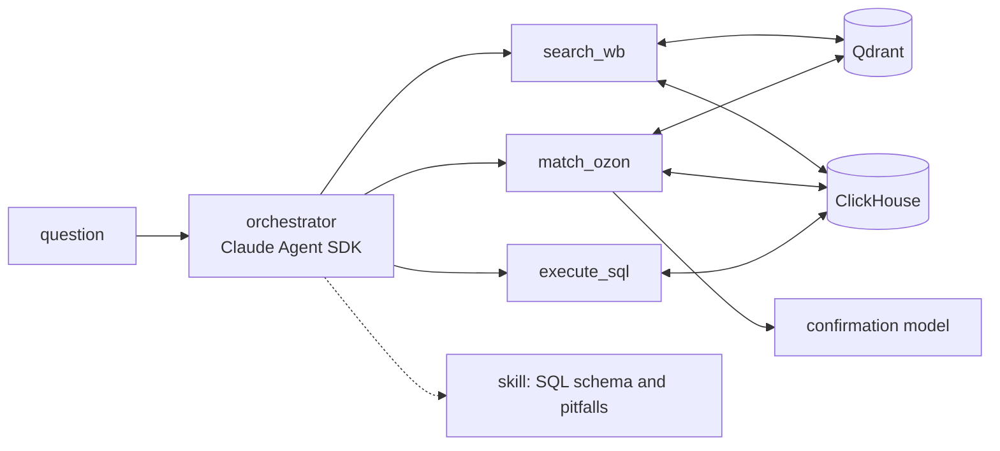
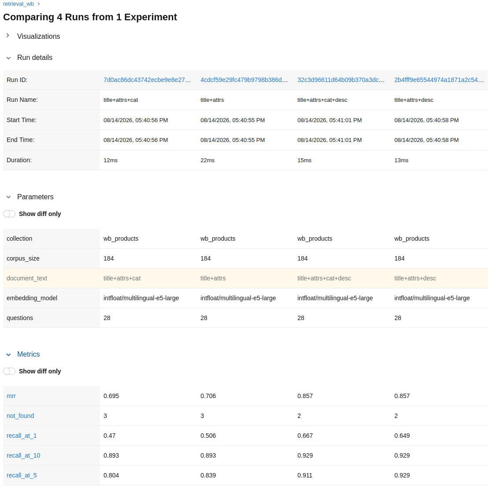
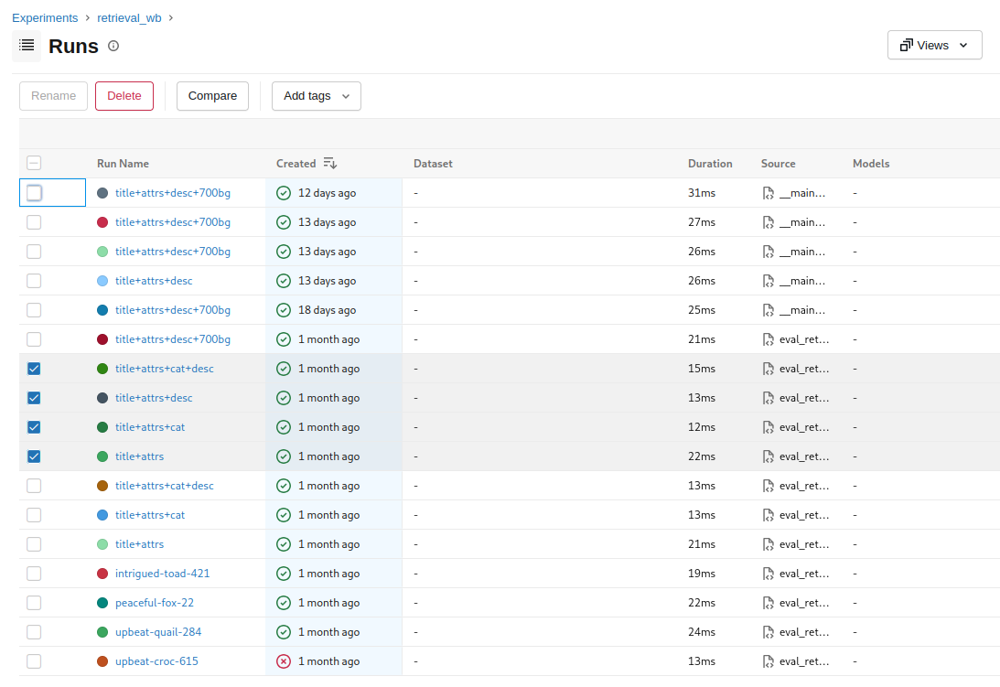
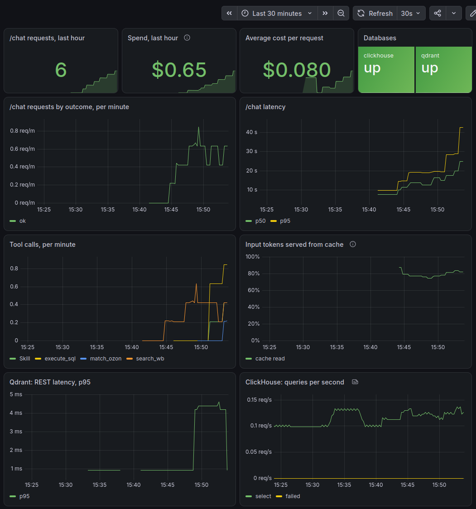

# crossmarket-agent

**English** | [Русский](README.ru.md)

An agent system for comparing products and prices across the Wildberries and Ozon marketplaces. It
finds a product by description, looks for the same product on the other marketplace, and computes
price aggregates.

- **Three tools behind one orchestrator:** RAG over the Qdrant vector database, matching of
  products between marketplaces, and turning a question into SQL executed against ClickHouse.
- **The database schema and the SQL pitfalls are packaged as a Claude Agent SDK skill,** not pasted
  into the prompt.
- **An eval harness** with held-out test splits, and calibrated LLM judges built on top of it.
- **Observability**, with the cost estimate reconciled against the actual bill.



*Starting the service and two questions: a plain search and a chain across three tools.*

## Metrics

Every number below comes from held-out test splits that were never used while tuning the prompts.

| what is measured | metric | test split | value |
|---|---|---|---|
| search without the agent | recall@1 / MRR | 11 questions of 28 | 0.682 / 0.783 |
| the agent's answer over search (A) | correct outcome, refusal "not in the database" included | 24 of 61 | 1.000 |
| text2sql (C) | query result matches the reference | 19 of 48 | 0.895 |
| routing across three tools | the right tool is called first | 27 of 66 | 1.000 |
| WB ↔ Ozon matching (B) | F1 (precision / recall), mean of three runs | 61 pairs of 153 | 0.747 (0.862 / 0.660) |
| judge of the agent's answers | agreement with manual labels (baseline) | 17 answers of 40 | 0.941 (0.765) |
| judge of matching | agreement with the pair label (baseline) | 61 verdicts of 153 | 0.770 (0.656) |
| judge of SQL | agreement with the reference (baseline) | 76 answers of 192 | 0.882 (0.908) |

The rest of each set is the calibration part the prompts were tuned on, and it never enters the
reported values. The run gifs below show both figures: every suite reports metrics over the whole set
and over the test split.

**The 1.000s say the task is easy, not that the system is perfect.** The corpus is small at 427
listings, the questions are of moderate difficulty, and the test splits are a few dozen cases each: on
27 questions even a flawless run puts the lower bound of the confidence interval at 0.88, and on 24 at
0.86. Resolving power had to come from elsewhere — from running a second model: on the same answers
haiku scores 0.833 instead of 1.000, and on two-tool routing 0.955 over the full set. On a larger
corpus and with trickier questions these numbers will come down; as they stand they measure an easy
regime, and that is a limit of the measurement rather than a result.

The ease does not come from picking easy questions: 24 borderline questions in the routing set were
written precisely to break the choice between tools, and none of them did. The only cases left out of
the metric are the multihop chains, where several calls are correct and the question does not fix the
order between them.

`baseline` is what a judge that gives the same answer to every case would score. The SQL judge does
not beat it: a text2sql miss is a plausible query with the wrong result, and without executing both
queries it cannot be told from a correct one. That is why it is not used anywhere: it stays out of the
reported values, has no part in the production path, and is kept as a documented negative result — a
judge that failed its check costs less than a judge that was trusted without one.

The weak spot is matching: retrieval brings in the candidates without losses, and a third of the pairs
are lost at the confirmation step, because the listing does not carry the attribute that would
identify the pair. Full breakdown — [docs/metrics.en.md](docs/metrics.en.md).

## How a request flows

"Find a cat scratcher on WB, look for an exact counterpart on Ozon, find out what it costs there,
and give me the three products closest to it in price":



*The trace in Langfuse: the timeline of calls, the cost of each, and the final answer.*

1. `search_wb` — semantic search in Qdrant, 0.2 s.
2. `match_ozon` — five candidates from Ozon, each sent to the confirmation model in its own call.
   The calls run in parallel: 7.4 s instead of 34 s in sequence. One candidate is confirmed.
3. `Skill` → `execute_sql` — the orchestrator loads the knowledge of the ClickHouse schema and
   writes a query for the three Ozon products nearest in price.

23 s and $0.155 in total: $0.076 for the orchestrator and $0.078 for the five calls to the
confirmation model. Those are separate SDK requests, so their cost has to be added to the answer
explicitly; without that the request would look half as expensive as it is.

<details>
<summary>All traces in Langfuse</summary>



*Traces of every run: input, output, latency and cost of each call.*

</details>

## Design



- **The orchestrator owns the control flow.** The agent decides what to call and in what order: it
  reads each tool result and decides from it whether another call is needed, so the chain is built
  by the model rather than hard-coded.
- **The snapshot is the only source.** Prices and listings come from the databases; nothing is
  fetched from the live sites. The SDK's built-in tools (web, shell, files) are removed by
  configuration rather than asked about in the prompt. If a product is not in the snapshot, the agent
  says so instead of guessing.
- **Matching never passes a similar product off as the same one.** If no candidate is confirmed, the
  result is empty.
- **The stop condition is deterministic:** a turn limit and a dollar budget, both enforced by the SDK
  rather than left to the model.
- **The corpus was collected semi-manually** with a browser scraper: 427 listings, 153 labeled
  WB ↔ Ozon pairs. The embedder is a local `multilingual-e5-large`.

## Eval

- **The golden set was split into calibration and test before any tuning began.** The split is stored
  in the file rather than recomputed on read, so adding cases never moves the boundary.
- **Direct metrics come first.** A judge is introduced only where there is no ground truth, and only
  after its agreement with the truth has been verified on the test split.
- **The harness prints progress and tables**, writes a markdown report into
  [evals/reports/](evals/reports/) and metrics into MLflow. Saved runs are regraded without calling
  the model again.
- **Settings are chosen by measurement,** and what each measurement showed is collected in
  [docs/findings.en.md](docs/findings.en.md). The text that goes into the vector, for example, was
  picked by running four variants against one golden set:



*Comparing runs in MLflow: four text compositions in the vector on one golden set.*

<details>
<summary>Runs in MLflow</summary>



*The `retrieval_wb` experiment: the run history the comparison is built from.*

</details>

<details>
<summary>Run: retrieval</summary>


*recall@k and MRR on the golden set, corpus with the distractor background.*

</details>

<details>
<summary>Run: the agent's answers (A)</summary>


*61 questions end-to-end: correct outcome, listings cited, the answer checked against tool output.*

</details>

<details>
<summary>Run: text2sql (C)</summary>


*48 questions: the agent's query is re-executed and compared with the reference one.*

</details>

<details>
<summary>Run: routing</summary>


*75 questions: which tool the orchestrator calls first.*

</details>

<details>
<summary>Run: matching (B)</summary>


*61 labeled pairs: precision, recall and F1 against the labeler's marks.*

</details>

## Observability and cost

FastAPI with `/chat`, `/health` and `/metrics`, Prometheus and Grafana with a dashboard and four
alerts, agent traces in Langfuse.



*The dashboard: requests by outcome, latency, cost, tool calls and cache share, database metrics.*

Cost in the reports is the SDK's own estimate, not an invoice. It was reconciled against the Console
bill: for the orchestrator the two matched down to the token, while for the confirmation model a
stale price table in the SDK overstated the cost by half. Details —
[docs/metrics.en.md](docs/metrics.en.md#cost).

## What broke

The log is [docs/failures.en.md](docs/failures.en.md). The most instructive cases:

- **A broken measurement looked like a weakness of the model.** The refusal check missed some
  phrasings, so the metric read 0.867 on far misses even though the agent had refused correctly on
  all 33 negative questions. It surfaced only because the raw answers are printed next to the number.
- **The model committed to a verdict before it reasoned.** Asked for the verdict first and the
  reasoning second, it confirmed obviously unrelated listings and then argued against itself in the
  next line. The tempting fix was worse than the bug: a score threshold appeared to repair the metric,
  but only because it filtered out the very listings the model was failing on.
- **The Langfuse instrumentation silently failed to attach.** The run completed and produced no
  traces: an early import had bypassed the patched function, and nothing reported a problem.

## Running it

```
make up        # Qdrant and ClickHouse
make serve     # /chat, /health, /metrics on :8000
make ask       # ask the agent questions from the terminal
make eval      # every suite: stdout, reports, MLflow
make observe   # + Prometheus and Grafana
```

## Data

The data was scraped from the Wildberries and Ozon sites and labeled by hand. **The repository
contains no data** — no corpus, no labels, no background of 700 distractors — so the numbers cannot
be reproduced from a clone. Only the golden sets of questions, the run reports and the code are in
git.

## Stack

Claude Agent SDK, Qdrant, ClickHouse, sentence-transformers, MLflow, Langfuse, FastAPI,
Prometheus, Grafana.

MIT.
