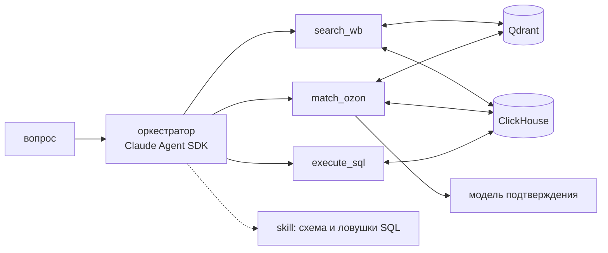

# crossmarket-agent

[English](README.md) | **Русский**

Агентная система для сравнения товаров и цен между Wildberries и Озоном. Находит товар по
описанию, ищет тот же товар на второй площадке, считает агрегаты по ценам.

- **Три тула за одним оркестратором:** RAG на векторной БД Qdrant, матчинг товаров между
  маркетплейсами, преобразование вопроса в SQL и его исполнение в ClickHouse.
- **Знание о схеме и ловушках SQL вынесено в отдельный скилл** Claude Agent SDK.
- **Eval-харнесс** с отложенными тест-сплитами и калиброванные LLM-судьи поверх него.
- **Observability** со сверкой стоимости по счёту.


*Запуск сервиса и два вопроса агенту: простой поиск и цепочка из трёх тулов.*

## Метрики

Все метрики — с отложенных тест-сплитов, которые не участвовали в доводке промптов.

| что меряется | метрика | тест-сплит | значение |
|---|---|---|---|
| поиск без агента | recall@1 / MRR | 11 вопросов из 28 | 0.682 / 0.783 |
| ответ агента по поиску (A) | верный исход, включая отказ «в базе нет» | 24 из 61 | 1.000 |
| text2sql (C) | результат запроса совпал с эталонным | 19 из 48 | 0.895 |
| роутинг между тремя тулами | первым вызван нужный тул | 27 из 66 | 1.000 |
| матчинг ВБ ↔ Озон (B) | F1 (precision / recall), среднее трёх прогонов | 61 пара из 153 | 0.747 (0.862 / 0.660) |
| судья ответов агента | согласие с ручной разметкой (baseline) | 17 ответов из 40 | 0.941 (0.765) |
| судья матчинга | согласие с меткой пары (baseline) | 61 вердикт из 153 | 0.770 (0.656) |
| судья SQL | согласие с эталоном (baseline) | 76 ответов из 192 | 0.882 (0.908) |

Вторая часть каждого набора — калибровочная, на ней доводились промпты, и в отчётные значения она
не идёт. В gif с прогонами ниже видны оба числа: сюита считает метрики и по всему набору, и по
тесту.

**Единицы в таблице — про лёгкость задачи, а не про совершенство системы.** Корпус маленький, 427
карточек, вопросы средней сложности, а тест-сплиты — десятки кейсов: на 27 вопросах даже безошибочный
прогон даёт нижнюю границу доверительного интервала 0.88, на 24 — 0.86. Разрешающую способность
пришлось добывать отдельно, прогоном второй модели: на тех же ответах haiku даёт 0.833 вместо 1.000,
а на роутинге по двум тулам — 0.955 по полному набору. На большом корпусе и на более каверзных
вопросах эти метрики просядут: сейчас они меряют лёгкий режим, и это граница замера, а не результат.

Лёгкость эта не от отбора вопросов: 24 пограничных вопроса в наборе роутинга писались ровно затем,
чтобы развилку сломать, и не сломали. Вне метрики оставлены только мультихоповые цепочки — верных
вызовов там несколько, а порядок между ними вопросом не задан.

`baseline` — согласие судьи, отвечающего одинаково на всё. Судья SQL его не обыгрывает:
промах text2sql — правдоподобный запрос с не тем результатом, и без исполнения он неотличим
от верного. Поэтому он в системе и не используется: в отчётные значения не входит, на прод-путь не
влияет и оставлен как задокументированный отрицательный результат — проверка, которую судья не
прошёл, стоит дешевле, чем судья, которому поверили без проверки.

Слабое место — матчинг: кандидатов поиск достаёт без потерь, а треть пар теряется на подтверждении,
потому что в карточке нет признака, по которому пару можно отождествить. Разбор всех метрик —
[docs/metrics.md](docs/metrics.md).

## Как проходит запрос

«Найди на ВБ когтеточку, поищи на Озоне полный аналог, узнай, сколько она там стоит, и выдай
три самых близких по цене товара»:


*Трейс в Langfuse: таймлайн вызовов, стоимость каждого и итоговый ответ.*

1. `search_wb` — поиск по смыслу в Qdrant, 0.2 с.
2. `match_ozon` — пять кандидатов с Озона, и по каждому отдельный вызов модели подтверждения.
   Вызовы идут параллельно: 7.4 с вместо 34 последовательно. Подтверждён один кандидат.
3. `Skill` → `execute_sql` — оркестратор загружает знание о схеме ClickHouse и пишет запрос
   на три товара Озона с ближайшей ценой.

Итого 23 с и $0.155. Из них $0.076 — оркестратор, $0.078 — пять вызовов модели подтверждения.
Они идут отдельными запросами SDK, и их стоимость складывается в ответ явно: иначе запрос
выглядел бы вдвое дешевле.

<details>
<summary>Все трейсы в Langfuse</summary>


*Трейсы всех прогонов: вход, выход, задержка и стоимость каждого вызова.*

</details>

## Устройство



- **Control flow у оркестратора.** Агент сам решает, что звать и в каком порядке, видит выдачу
  тула и по ней решает, звать ли следующий, — цепочка из нескольких тулов собирается им самим.
- **Только снапшот.** Цены и карточки берутся из баз, живых страниц нет. Встроенные тулы SDK
  (веб, шелл, файлы) сняты конфигурацией, а не просьбой в промпте. Товара нет в снапшоте —
  агент так и говорит.
- **Матчинг не выдаёт похожее за то же.** Ни один кандидат не подтверждён — результат пустой.
- **Остановка детерминированная:** лимит ходов и бюджет в долларах, оба нативные в SDK.
- **Корпус собран полуручно** браузерным скрапером: 427 карточек, 153 размеченные пары
  ВБ ↔ Озон. Эмбеддер — локальный `multilingual-e5-large`.

## Eval

- **Golden-set разбит на калибровку и тест до начала доводки.** Сплит хранится в файле, а не
  считается при чтении, поэтому новые кейсы не сдвигают границу.
- **Прямые метрики первичны.** Судья появляется там, где эталона нет, и только после проверки
  согласия с истиной на тесте.
- **Харнесс печатает прогресс и таблицы**, пишет markdown-отчёт в [evals/reports/](evals/reports/)
  и метрики в MLflow. Сырые прогоны пересчитываются без повторного вызова модели.
- **Настройки выбираются замером,** а выводы по каждому замеру собраны в
  [docs/findings.md](docs/findings.md). Например, состав текста в векторе — четыре варианта на
  одном golden-set:


*Сравнение прогонов в MLflow: четыре состава текста в векторе на одном golden-set.*

<details>
<summary>Прогоны в MLflow</summary>


*Эксперимент `retrieval_wb`: история прогонов, из которой собирается сравнение.*

</details>

<details>
<summary>Прогон: retrieval</summary>


*recall@k и MRR на golden-set, корпус с фоном из дистракторов.*

</details>

<details>
<summary>Прогон: ответы агента (A)</summary>


*61 вопрос end-to-end: верный исход, цитирование карточек, проверка ответа по выдаче тула.*

</details>

<details>
<summary>Прогон: text2sql (C)</summary>


*48 вопросов: запрос агента переисполняется и сравнивается с эталонным.*

</details>

<details>
<summary>Прогон: роутинг</summary>


*75 вопросов: какой тул оркестратор вызывает первым.*

</details>

<details>
<summary>Прогон: матчинг (B)</summary>


*61 размеченная пара: precision, recall, F1 против меток разметчика.*

</details>

## Observability и стоимость

FastAPI с `/chat`, `/health` и `/metrics`, Prometheus и Grafana с дашбордом и четырьмя
алертами, трейсы агента в Langfuse.


*Дашборд: запросы по исходу, задержка, стоимость, вызовы тулов и доля кэша, метрики баз.*

Стоимость в отчётах — оценка SDK, а не счёт. Оценка сверена со счётом Console: по оркестратору
совпала до токена, по модели подтверждения устаревший прайс в SDK завышал её в полтора раза.
Подробности — [docs/metrics.md](docs/metrics.md#стоимость).

## Что ломалось

Лог — [docs/failures.md](docs/failures.md). Самое поучительное:

- **Сломанный измеритель выглядел как слабость модели.** Проверка отказа не распознавала часть
  формулировок, и метрика на далёких промахах показала 0.867, хотя агент верно отказал на всех 33
  отрицательных вопросах. Увидели это только по сырым ответам, напечатанным рядом с числом.
- **Модель ставила вердикт до рассуждения.** С форматом «вердикт, потом обоснование» она
  подтверждала заведомо чужие карточки и тут же себя опровергала. Хуже цифры была ручка, которую
  она подсказывала: порог по скору «чинил» метрику, потому что отсекал именно те карточки, на
  которых модель срывалась.
- **Инструментирование Langfuse молча не подключилось.** Прогон прошёл, трейсов нет: ранний
  импорт обходил подмену функции, и никто не пожаловался.

## Запуск

```
make up        # Qdrant и ClickHouse
make serve     # /chat, /health, /metrics на :8000
make ask       # вопросы агенту из терминала
make eval      # все сюиты: stdout, отчёты, MLflow
make observe   # + Prometheus и Grafana
```


## Данные

Данные собраны скрапером с сайтов ВБ и Озона, размечены руками. **Данных в репозитории нет** —
ни корпуса, ни разметки, ни фона из 700 дистракторов, поэтому цифры из клона не воспроизводятся.
В гит идут только golden-set с вопросами, отчёты прогонов и код.

## Стек

Claude Agent SDK, Qdrant, ClickHouse, sentence-transformers, MLflow, Langfuse, FastAPI,
Prometheus, Grafana.

MIT.
